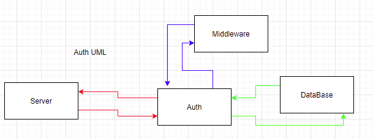

# Basic-Auth

## Auth

Auth is hashing out password along with our username that creates a hashed password and username.

## Technology Used

`"base-64": "^1.0.0"`  
`"bcrypt": "^5.0.0"`  
`"cors": "^2.8.5"`  
`"dotenv": "^8.2.0"`  
`"express": "^4.17.1"`  
`"jest": "^26.6.3"`  
`"pg": "^8.6.0"`  
`"sequelize": "^6.6.2"`  
`"sequelize-cli": "^6.2.0"`  
`"sqlite3": "^5.0.2"`  

## CRUD / REST

POST route for /signup

```
Accepts JSON or FORM Data with the keys "username" and "password"
Uses postgres to create your new record
Returns a 201 for your created user record
```

POST route for /signin

```
Using middleware, we authicate your information to log in
When validated, sends JSON user record
```

## Whiteboard UML



## Routes

```
/signup

/signin
```
## Install

```
npm i
```

## Usage

```
npm run dev
```

## Deployment

[Heroku Deployment](https://basic-auth-401n19.herokuapp.com/)

## Collaboration

- Ayrat Govin
- Heather Bisgard
